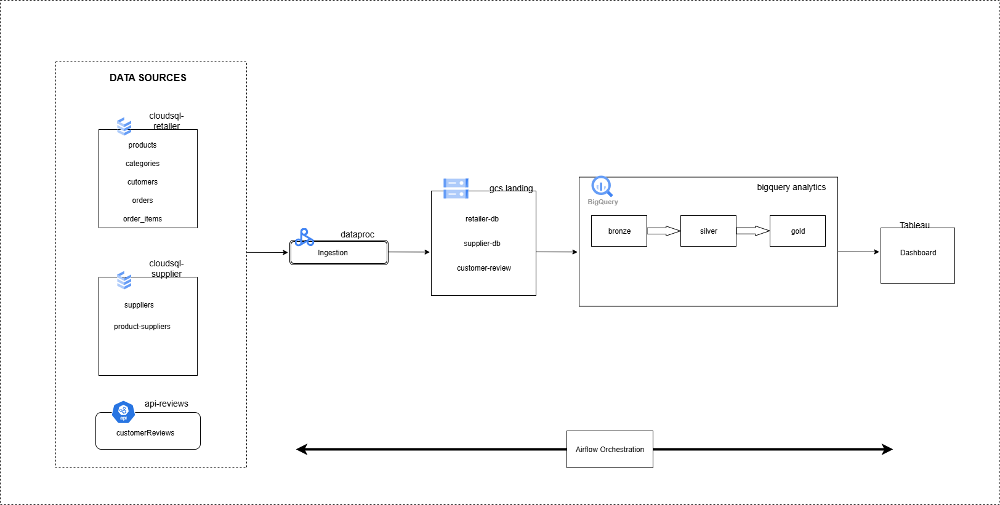

# Retailer Data Lake

A comprehensive data lake solution for retail businesses, enabling centralized data storage, processing, and analytics using Google Cloud Platform services.

## 🏗️ Architecture Overview

This project implements a scalable data lake architecture that ingests data from multiple sources, stores it in Google Cloud Storage, and provides business intelligence capabilities through Tableau.

### Technology Stack

- **Database**: Google Cloud SQL (PostgreSQL)
- **Data Lake Storage**: Google Cloud Storage (GCS)
- **Orchestration**: Cloud Composer

## 🎯 Why a Data Lake?

A data lake enables retailers to store and analyze data efficiently, unlocking valuable insights for business growth.

### Key Benefits

- **Centralized Data Access**: Provides a single repository for all retailer data, accessible across departments
- **Scalability**: Handles large volumes of data seamlessly without performance issues
- **Data Flexibility**: Supports multiple data formats (structured, semi-structured, unstructured) and various query engines
- **Cost-Effective**: Pay-as-you-go storage model with Google Cloud Storage
- **Advanced Analytics & AI**: Empowers businesses to perform deep analytics, uncover trends, and enhance decision-making

## 📊 Data Sources

The system ingests data from three main sources:

### 1. Cloud SQL Retailer Database (`cloudsql-retailer`)

Contains key business data such as:

- `products`
- `categories`
- `customers`
- `orders`
- `order_items`

### 2. Cloud SQL Supplier Database (`cloudsql-supplier`)

Contains supplier-related information:

- `suppliers`
- `product_suppliers`

### 3. API Reviews (`api-reviews`)

Here we will mock the api using [mock.io](https://mockapi.io/) service
Captures customer feedback from external sources:

- `customer_reviews`

## 🔄 Data Flow Architecture

```
Cloud SQL DBs → Data Extraction → GCS Data Lake → Data Processing → Tableau
     ↓              ↓                ↓              ↓                ↓
  Retailer DB   Apache Airflow    Bronze Layer   Silver Layer   Dashboards
  Supplier DB      (ETL)          (Raw Data)   (Cleaned Data)   & Reports
  API Reviews                                    Gold Layer
                                              (Business Ready)
```



### Data Processing Layers

#### 1. Data Landing in GCS

Once extracted, the data is landed into Google Cloud Storage (GCS) under separate folders:

- `gs://bucket-name/landing/retailer-db/` - Raw retailer data
- `gs://bucket-name/landing/supplier-db/` - Raw supplier data
- `gs://bucket-name/landing/customer-reviews/` - Raw reviews data

#### 2. Data Processing in BIGQUERY (Medallion Architecture)

The data is processed through three layers stored in Bigquery:

- **Bronze Layer** (`project-id.bronze.table-name`): Raw data from Cloud SQL and APIs stored as-is
- **Silver Layer** (`project-id.silver.table-name`): Data cleaned, standardized, and transformed for improved quality
- **Gold Layer** (`project-id.gold.table-name`): Final business-ready datasets optimized for analytics

#### 4. Workflow Orchestration with Airflow

All processes automated and monitored through Apache Airflow

## 🚀 Key Benefits

✅ **Scalability** – Handles large datasets efficiently in GCS  
✅ **Data Quality** – Ensures clean and enriched data at the Gold Layer  
✅ **Automation** – Airflow orchestrates workflows efficiently  
✅ **Cost-Effective** – Pay-as-you-go storage with GCS
✅ **Real-time Insights** – Tableau provides dashboards for business decision-making

## 📁 Project Structure

```
retailer-data-lake/
├── README.md
├── requirements.txt
├── .gitignore
```

## 🛠️ Prerequisites

- Python 3.8+
- Google Cloud Platform account with the APIs enabled.
- Google Cloud SQL instances (retailer & supplier databases).
- Google Dataproc cluster

## ⚙️ Quick Start

### 1. Clone the Repository

```bash
git clone https://github.com/adobhal95/retailer-data-lake.git
cd retailer-data-lake
```

## 📈 Data Pipeline Workflows

### Daily Data Ingestion

1. **Extract** data from Cloud SQL databases and APIs to gcs datalake.
2. **Load** raw data to bigquery bronze layer in json/parquet format(depending on table).

   a. Here while loading data, I've used incremental or full load data strategy based on the table type. If table data changes frequently will incremental load the table based on the latest checkpoint. If table's data changes less frequently we can fully load the data.

3. **Transform** data through silver layer (cleaning and validation)
4. **Aggregate** data in gold layer for business consumption

## 🚀 Deployment Options

1. For learning purpose first we will eeploy each services manually. Go through the [config]("../config/main_instructions.md") folder for further instructions.
2. For managed deployment, will be using cloud composer and cloud build.
   a. Cloud Composer to run dags.
   b. Cloud Build to push the changes made in code (CI/CD).

### Google Cloud Deployment

- Google Cloud Composer for Airflow.
- Cloud SQL for operational databases.
- Cloud Storage for data lake.
- Google Cloud Dataproc for managed apache spark service.
